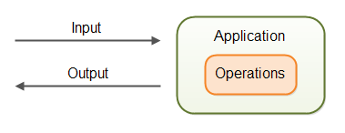

# 国际化简介

Java Internationalization (i18n) 是 Java 内置的支持，使您的应用程序能够以多种语言为用户提供服务，事实上，国际化不仅涵盖语音，还包括数字格式化，日期和时间调整等。

国际化是您对 Java 程序所做的工作，使其能够处理不同的语音，数字格式等。

本地化是 Java 应用程序在适应特定语音，数字格式，日期和时间的用户所执行的操作。

国际化和本地化是同一个故事的两个方面，您的应用程序需要国际化才能本地化。

Internationalization 常常被简写为 i18n, 18 指的是第一个字符 `i` 和最后一个字符 `n` 之间的 18 个字符，Localization 一般简写为 L18n。

### 国际化概览

国际化应用程序通常意味着应用程序能够处理多种语音，数字格式，日期格式等。

基本上，你的应用程序应该能够处理国际化输入，输出和操作，换句话说，您的应用程序应该能够适应不同位置和用户首选项的输入、输出和操作。如图：  

