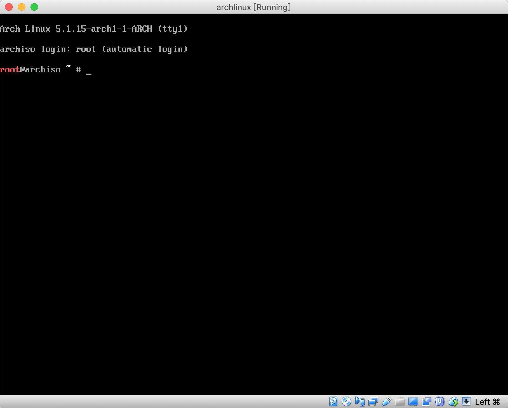

# Archlinux 安装

> 本文是基于虚拟机进行安装，参考[wiki](https://wiki.archlinux.org/index.php/Installation_guide) 进行操作，但在实际操作中做了一些简化，如在安装过程中有任何问题，请以 wiki 为准, 本文开始于 2019.07.02，安装环境，本机是 MacOS，虚拟机软件是 VirtualBox。

### 1. archlinux 官网下载对应的 ISO 文件

### 2. VirtualBox 创建虚拟机, 先不要启动

1. 内存设置 4G
2. 网络连接设置为：网络地址转换(NAT)

### 3. 启动虚拟机

1. 点击 VirtualBox 的启动按钮，启动虚拟机，如图下图

2. 点击回车，最终出现如下图界面


### 4. 键盘布局,默认即可

默认键盘布局是 `us`（美式键盘映射）, 要是列出所有的键盘布局，可以使用：
```
# ls /usr/share/kbd/keymaps/**/*.map.gz
```

### 5. 验证启动模式

如果以在 UEFI 主板上启用 UEFI 模式，`archiso` 将会使用 `systemd-boot` 来 启动 Arch Linux。可以列出 efivars 目录以验证启动模式：

```
# ls /sys/firmware/efi/efivars
```

如果目录不存在，系统可能以 BIOS 或 CSM 模式启动，详见您的主板手册。关于 UEFI 说明请自行查阅资料。

> 我的默认不支持 UEFI，以下操作均是以非 UEFI 的方式操作

### 6. 配置网络

1. 查看系统是否启用了网络接口，命令如下：
```
# ip link
```
2. 配置网络连接
    具体详见[网络配置](./archlinux-network.md)
3. 测试网络连接情况
```
# ping www.baidu.com
```
### 7. 更新系统时间
使用如下命令更新系统时间：
```
# timedatectl set-ntp true
```
可以使用 `timedatectl status` 查看服务状态。

### 8. 建立硬盘分区
磁盘若被系统识别到，就会被分配一个设备块，如 `/dev/sda`, 可以使用 `lsblk` 或者 `fdisk` 查看

```
# fdisk -l
或者 
# lsblk
```
列表中以 `loop`，`rom` 或者 `airoot` 结束的可忽略

使用 `fdisk` 创建分区
```
# fdisk /dev/sda
```
然后根据提示进行分区即可。我的分区如下：

序号       | 分区         | 大小
-----------|--------------|------------
    1      | `/`          | 20G
    2      | `/boot`      | 200M
    3      | `/home`      | 剩下所有
没有 swap 分区，因为 swap 分区和 swap 文件的效果是一样的，故使用 swapfile 代替 swap 分区

使用如下命令查看分区情况
```
# fdisk -l /dev/sda
```

### 9. 格式化分区
分区建立好之后，都要使用适当的文件系统进行格式化，本文使用 `ext4` 文件系统。

```
# mkfs.ext4 /dev/sdaX
```
如果创建了交换分区，使用 `mkswap` 将其初始化

```
# mkswap /dev/sdaX
# swapon /dev/sdaX
```

### 10. 挂载分区

首先在 `/mnt` 目录下创建 `boot` 和 `home` 目录。

将根分区挂载到 `/mnt` 下，例如：
```
# mount /dev/sda1 /mnt
```
其他分区挂载到响应的目录下。

```
# cd /mnt
# mkdir boot & mkdir home
# mount /dev/sda1 /mnt
# mount /dev/sda2 /mnt/boot
# mount /dev/sda3 /mnt/home
```

### 11. 选择镜像

文件 `/etc/pacman.d/mirrorlist` 定义了软件包会从哪个镜像源下载，在 LiveCD 启动的系统上，所有的镜像都被启用，在列表中越前的镜像在下载软件包时有越高的优先权。这个文件接下来还会被 `pacstrap` 拷贝到新系统里，所以请确保设置正确。

我的镜像文件内容如下：
```
todo 
```

### 12. 安装基本系统
使用 pacstrap 脚本，安装 base, base-devel 组,若想安装其他的也可以添加到后面，并用空格隔开。也可以在 `Chroot` 之后，使用 `pacman` 安装。

```
# pacstrap /mnt base base-devel vim git net-tools curl wget
```

### 13. 生成 fatab
使用以下命令生成 `fatab` 文件，强烈建议，执行完命令之后，检查一下 `/mnt/etc/fstab` 文件

```
# genfstab -U /mnt >> /mnt/etc/fstab
```

### 14. Chroot 到新安装的系统

Chroot root 到新安装的系统
```
# arch-chroot /mnt
```

### 15. 设置时区

设置为上海时区

```
# ln -sf /usr/share/zoneinfo/Asia/Shanghai /etc/localtime
```
运行 `hwclock` 以生成 `/etc/adjtime`

```
# hwclock --systohc
```

### 16. 本地化

在 `locale.gen` 与 `locale.conf` 设置本地化，`locale.gen` 是一个仅包含注释文档的文本文件，只需要移出对应前面的 `#` 即可，注意，选择 `UTF-8` 的项。

```
# vim /etc/locale.gen
------------------------
en_US.UTF-8 UTF-8
zh_CN.UTF-8 UTF-8
```

接着运行 `locale-gen` 以生成 locale 信息

```
# locale-gen
```

创建 `locale.conf` 并编辑 `LANG` 这一变量，如：

```
# vim /etc/locale.conf
---------------------------
LANG=en_US.UTF-8
```
注意，此时不要设置成中文，以防 TTY 乱码


### 17. 配置网络

创建 `hostname` 文件。

```
vim /etc/hostname
-----------------
javaliu
```
编辑 `/etc/hosts` 文件，添加如下信息

```
vim /etc/hosts
------------------
127.0.0.1   localhost
::1         localhost
127.0.0.1   javaliu.localdomain     javaliu
```

### 18. 设置 root 密码

```
# passwd
```

### 19. 安装引导程序

你需要安装 Linux 引导程序以在安装后启动系统，你可以使用的的引导程序在 启动加载器 中，请选择一个并且安装并配置它，比如 GRUB。

安装 grub
```
# pacman -S grub
# grub-install --target=i386-pc /dev/sda
```
注意，其中 `/dev/sda` 是要安装 `GRUB` 的磁盘，而**不是**分区 `/dev/sda1`

安装完成之后，GRUB 在每次启动的时候载入配置文件 `/boot/grub/grub.cfg` 可以使用工具生成该配置文件。
```
# grub-mkconfig -o /boot/grub/grub.cfg
```
自动生成脚本默认将在生成的配置文件中为所有已安装的 Arch Linux 内核添加一个条目。

注意
* 每当修改 `/etc/default/grub` 或者 `/etc/grub.d/` 中的文件之后，都需要再次生成 `/boot/grub/grub.cfg`。
* 默认的文件路径是 `/boot/grub/grub.cfg`，而非 `/boot/grub/i386-pc/grub.cfg`。

### 20. 重启

输入 `exit` 或按 `Ctrl+D` 退出 `chroot` 环境。  
可选用 `umount -R /mnt` 手动卸载被挂载的分区

最后，通过执行 `reboot` 重启系统，`systemd` 将自动卸载仍然挂载的任何分区。不要忘记移除安装介质，然后使用 root 帐户登录到新系统。


