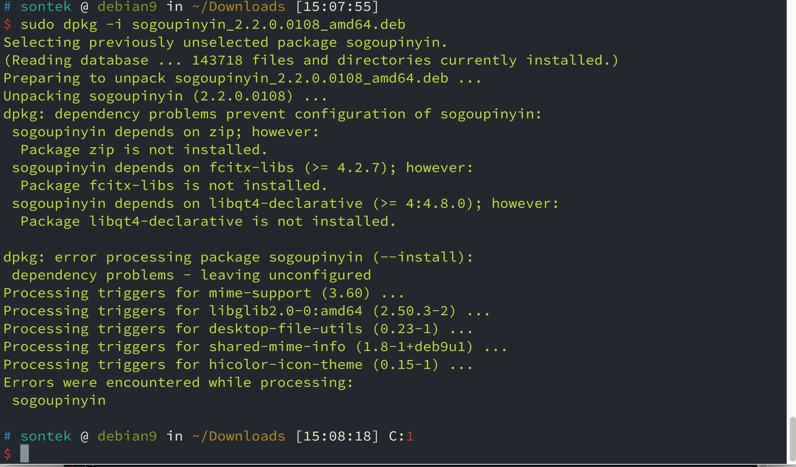

# Debian 安装之后的配置

安装完 `debian` 之后，需要进行一些配置，才能使得  `Debian` 使用起来更加方便，下面就一步一步配置 `Debian` 打造专属自己的开发环境。

### 1. 安装 Virtual Box Tools

为了使用`Virtual Box` 的增强功能，需要安装 Virtual-Box Tools，首先挂载 `Virtual Box Tools`，然后执行如下命令（root 用户操作）：

```shell
# cp -R /media/cdrom0 /tmp
# cd /tmp/cdrom0/
# ./VBoxLinuxAdditions.run
# reboot
```

### 2. 安装openssh-server，并配置

安装 `opens-server`:

```shell
# apt install openssh-server
```

默认安装的 `ssh`  配置文件不完整，需要对其进行简单的配置，编辑主配置文件，如下：

```shell
# vi /etc/ssh/sshd_config
```

将如下内容的注释去掉，即将其前面的  `#` 去掉

```shell
Port 22 								# 也可以修改为其他端口
PermitRootLogin no						# 禁止 root 登录
PermitEmptyPasswords no					# 禁止无密码登录
PasswordAuthentication yes				# 允许使用密码登录

PubkeyAuthentication yes				# 允许使用认证登录
AuthorizedKeysFile .ssh/authorized_keys # 认证文件位置

# 文件末尾添加如下内容
AllowUsers sontek
```

重启 `sshd` 服务

```shell
# systemctl restart ssh       # 重启服务

# 补充命令如下
# systemctl start ssh
# systemctl stop ssh
# systemctl status ssh
```

### 3. 安装 Java 开发环境

* 安装 JDK

  从Oracle 官网下载 JDK，下载JDK1.8

  ```shell
  $ tar -zxvf jdk-8u151-linux-x64.tar.gz
  $ mkdir -p ~/opt/mysoftware
  ```

  配置环境变量，编辑 `~/.zshrc`  文件，添加如下配置

  ```shell
  export JAVA_HOME=~/opt/mysoftware/jdk1.8.0_151
  export CLASSPATH=.:$JAVA_HOME/lib/tools.jar:$JAVA_HOME/lib/dt.jar
  export PATH=$JAVA_HOME/bin:$PATH
  ```

  启用配置，查看安装版本

  ```shell
  $ source .zshrc
  $ java -version
  java version "1.8.0_181"
  Java(TM) SE Runtime Environment (build 1.8.0_181-b13)
  Java HotSpot(TM) 64-Bit Server VM (build 25.181-b13, mixed mode)
  ```

* 安装 maven

  首先从 `Apache Maven` 官网，下载  `maven` 软件包，然后对其解压配置即可。

   ```shell
   $ tar -zxvf apache-maven-3.5.4-bin.tar.gz -C opt/mysoftware/maven-3.5.4
   ```

  配置环境变量，编辑 `~/.zshrc`  文件，添加如下配置

  ```shell
  export MVN_HOME=~/opt/mysoftware/maven-3.5.4
  export PATH=$MVN_HOME/bin:$PATH
  ```

  启用配置，查看安装版本

  ```shell
   $ source .zshrc
   $ mvn -v
   Apache Maven 3.5.4 (1edded0938998edf8bf061f1ceb3cfdeccf443fe; 2018-06-18T02:33:14+08:00)
  Maven home: /home/sontek/opt/mysoftware/maven-3.5.4
  Java version: 1.8.0_181, vendor: Oracle Corporation, runtime: /home/sontek/opt/mysoftware/jdk-1.8/jre
  Default locale: en_US, platform encoding: UTF-8
  OS name: "linux", version: "4.9.0-7-amd64", arch: "amd64", family: "unix"
  ```

  配置 `Maven` 本地仓库，先创建如下目录 `~/opt/repo`，然后编辑 `$MVN_HOME/conf/settings.xml` 文件，修改内容如下：

   ```shell
  <localRepository>~/opt/repo<localRepository>
   ```

* 安装IDEA

  从官网下载 `Linux` 版本的 `IDEA`，并解压：

   ```shell
  $ tar -zxvf ideaIU-2018.1.6.tar.gz -C opt/mysoftware/
  $ cd ~/opt/mysoftware/idea-IU/bin
  $ ./idea.sh							# 启动 IDEA
   ```

  激活 `IDEA`，访问如下网站进行激活。连接如下：

  [激活IDEA](http://idea.lanyus.com/)

### 4. 安装搜狗拼音输入法

到搜狗输入法官方网站，下载 linux 版搜狗拼音输入法，然后对其进行安装：

 ```shell
$ sudo dpkg -i sogoupinyin_2.2.0.0108_amd64.deb
 ```

出现如下错误：



根据提示显示是缺少软件包，安装缺少软件包

```shell
$ sudo apt install libqt4-declarative zip fcitx-libs
```

继续执行安装搜狗拼音输入法。然后重启。

### 5. 安装窗口管理器（i3）

安装 i3 窗口管理器

```shell
$ sudo apt install i3
```

可使用如下命令生成默认的配置文件

```shell
$ i3-config-wizard
```

配置

```shell
bindsym $mod+shift+x exec i3lock 锁屏
$mod + shift + r 使配置文件生效
exec firefox  表示启动 i3 时候，启动 firefox
feh 桌面相关
sudo apt install feh
feh --bg-scale /path/to/destop.jpg
exec_always feh --bg-scale /path/to/destop.jpg

# 查询是什么
sudo apt install arandr

定义变量
set $workspace "1: Terminal"

# 指定某个软件在指定的workspace

# 安装 FortAwesome / Fort Awesome 添加 icon
cp fonts ~/.fonts
fortawesome.github.io/cheatsheet

# 配置字体和字号
San Franceisco Fonts

# 配置 gtk
sudo apt install lxapperance

# 取色
http://www.color.picker.com
```

https://www.devpy.me/your-guide-to-a-practical-linux-desktop-with-i3wm/

### 6. 安装常用软件

* 安装 NodeJS  
    上 `Nodejs` 官网，下载对应平台的软件包，解压到指定目录，并配置环境变量，我的配置如下：

    ```shell
    $ vim ~/.zshrc
    # 添加如下配置
    export NODE_HOME=~/opt/mysoftware/node-8
    export PATH=$NODE_HOME/bin:$PATH

    # 使配置生效
    $ source .zshrc
    ```

* 安装 Chromium 浏览器

    ```shell
    $ sudo apt update
    $ sudo apt install chromium 
    ```

* 安装 Filezilla

    ```shell
    $ sudo apt update
    $ sudo apt install filezilla
    ```

* 安装视频播放器 VLC

    ```shell
    $ sudo apt install vlc
    # 使用 VLC
    $ vlc xxx.mp4
    ```

* 安装网易云音乐客户端，首先上网易云音乐官网下载对应的客户端

    ```shell
    $ sudo dpkg -i  netease-cloud-music_1.1.0_ubuntu_amd64.deb
    ```

* 安装邮件客户端

    ```shell
    $ sudo apt install thunderbird
    ```

* 安装 SVN

    ```shell
    $ sudo apt install subversion
    ```

* 安装 screenfetch 打印操作系统的 `logo` 和使用状态  

    ```shell
    $ sudo apt install screenfetch
    ```

* 科学上网 Shadowsocks  
    首先访问 [Github](https://github.com/shadowsocks) 找到 `shadowsocks-qt5` 项目  
    根据其 wiki 提示进行安装即可  
    如果是 `Chromium` 浏览器还需要安装插件，下载插件地址请点击[这里](https://github.com/FelisCatus/SwitchyOmega)  
    找到其对应的发行版，然后安装 `Chromium` 插件，对其进行配置即可。
    注意：
    如果安装不上插件，则将 `crx` 后缀的插件改成 `zip` 然后对其进行解压，然后将开发者模式打开，加载解压的文件夹即可

* 安装微信  
    访问 [Github](https://github.com/geeeeeeeeek/electronic-wechat) 按照上面的说明一步一步操作即可
    下载对应的发布版本，并解压到制定的目录，然后启动微信客户端

    ```shell
    $ cd elecontronic-wechat
    $ ./elecontronic-wechat
    ```
* 安装字体  
    首先是下载想要安装的字体,可参考如下网站.  
    [Github](https://github.com), [fontsquirrel](https://www.fontsquirrel.com)  
    然后在 `/usr/share/fonts/` 创建相应的字体目录  

    ```sehll
    sudo mkdir /usr/share/fonts/opentype/SourceCodePro
    或者将字体安装到家目录下
    mkdir ~/.fonts
    将字体拷贝到创建的目录下面
    ```

    将下载的字体解压到刚刚创建的目录中,然后执行如下命令:

    ```shell
    sudo fc-cache -f -v    使字体生效
    ```
