# Debian 安装之后的配置

安装完 `debian` 之后，需要进行一些配置，才能使得  `Debian` 使用起来更加方便，下面就一步一步配置 `Debian` 打造专属自己的开发环境。

1. 为了使用`Virtual Box` 的增强功能，需要安装 Virtual-Box Tools，首先挂载 `Virtual Box Tools`，然后执行如下命令（root 用户操作）：
```shell
	# cp -R /media/cdrom0 /tmp
	# cd /tmp/cdrom0/
	# ./VBoxLinuxAdditions.run
	# reboot
```

2. 添加 `sudo` 权限，使得普通用户也有 `root` 权限（root用户操作）, `Debian` 默认安装了 `sudo` 否则，应该首先安装 `sudo`，使用此命令 `# apt install sudo`
```shell
	# vi /etc/sudoers
	找到 
	root 	ALL=(ALL:ALL) ALL
	添加如下内容
	sontek  ALL=(ALL:ALL) ALL
	wq! 保存退出 vi
```

3. `Debian` 网络配置 （root用户操作），关于 `Debian` 的网络配置稍微复杂点，下面一一讲解。

   首先，`Debian` 使用两种方式配置网络，第一种是  `/etc/init.d/networking`，以下以 `networking`简称，第二种是 `/etc/init.d/network-manager`，以下以 `network-manager` 简称，两者之间只取其一，即尽量不要让两者同时使用。

   > 第一、使用 networking 配置网络

   首先禁用 `network-manager`，启用 `networking`，然后重启。

   ```shell
   # systemctl stop network-manager      停用 network-manager
   # systemctl status network-manager    查看 network-manager 状态
   # systemctl disable network-manager   开机不启动 network-manager
   
   # systemctl enable networking         开机启动 networking
   # systemctl start networking          启动 networking
   # systemctl status networking         查看 networking 状态
   
   # reboot
   ```

   `Virtual Box` 安装系统时，默认网络配置为 `NAT` 即 `网络地址转换NAT` ，这种方式配置的网络，本机不能访问安装的 `Debian` 虚拟机，但是 `Debian`  虚拟机可以访问外网。如果要实现虚拟机里面的 `Debian` 既能访问外网，又能实现与宿主主机的访问，有两种方式：`NAT + Host-Only` 方式，桥接方式。

   * NAT + Host-Only 既实现连接 `Internet` ，又能与宿主主机通信。

     将系统关机 `# shutdown -h now`

     启动 `Virtual Box` 按下 `Ctrl + g` 全局配置网络。如图所示

     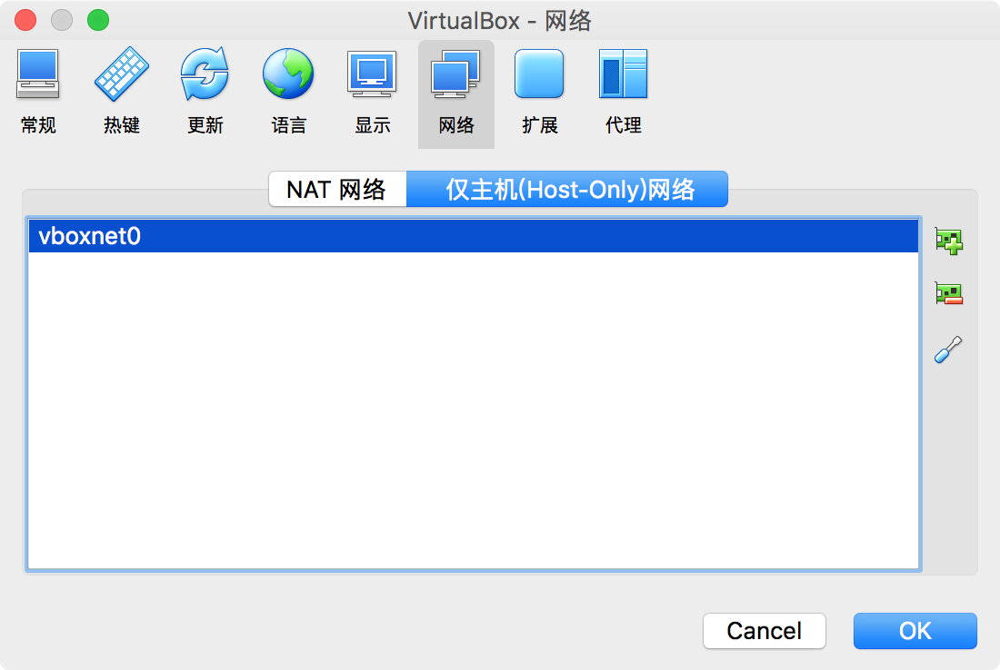 

     点击右侧的编辑按钮，配置静态IP 和 DHCP 如图所示：

     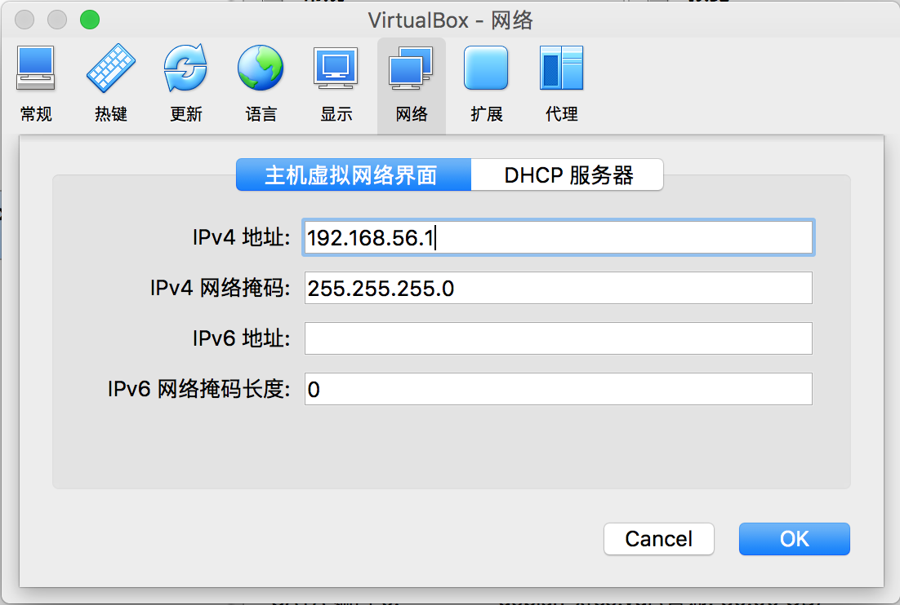

     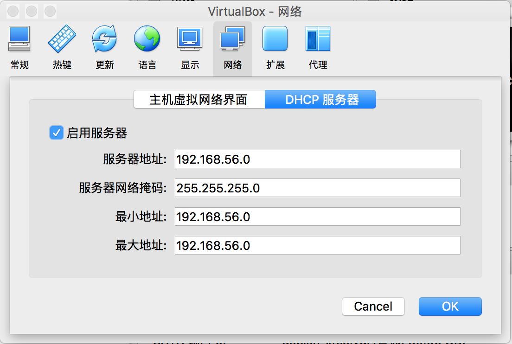

     给 `Debian` 虚拟机分别配置 `NAT` 和 `Host-Only` 两个网卡

     

     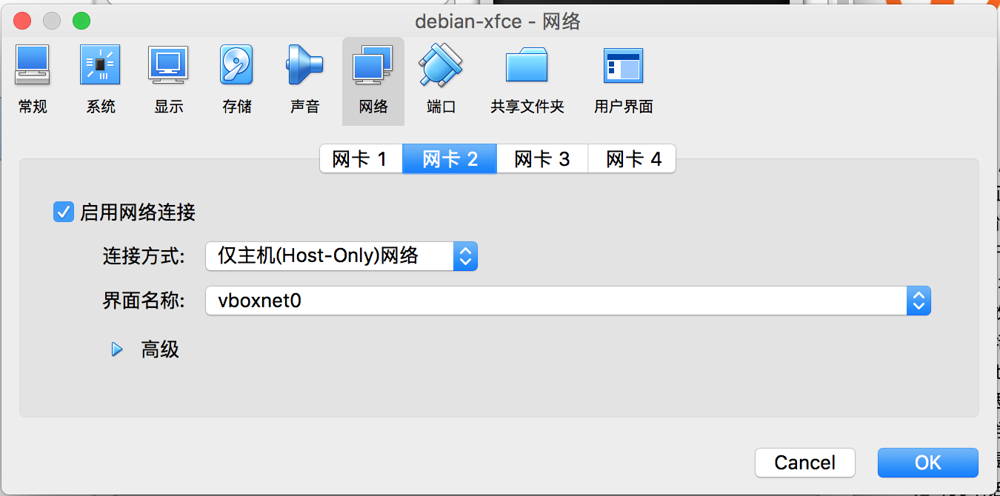

     启动 `Debain` ,打开终端，输入 `ip addr` 查看网络接口设备，如图：

     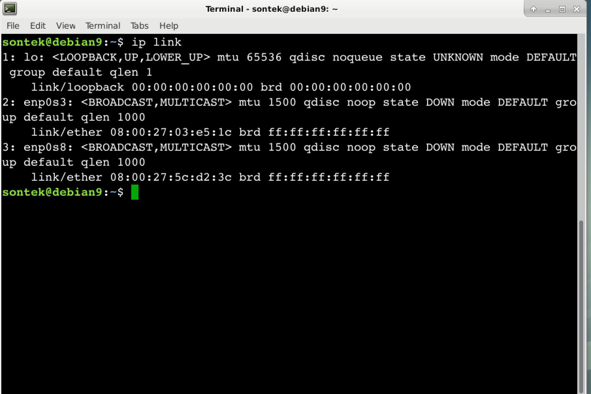

     `enp0s3` 为 `NAT` 网卡设备，`enp0s8`  为 `Host-Only` 网卡设备，下面进行配置：

     首先将 `/etc/network/interfaces.d/setup` 文件中关于 `eth0` 的配置注释掉，否则在启动网络服务时，会出现如下错误：ifup：bring up eth0 fail，原内容如下：

     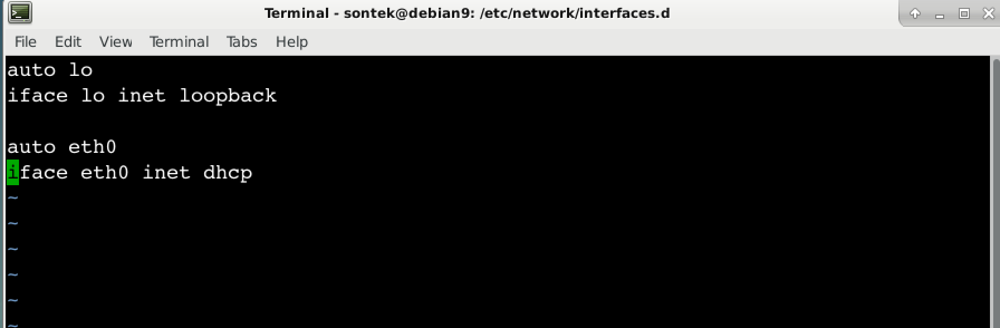

     修改后如下：

     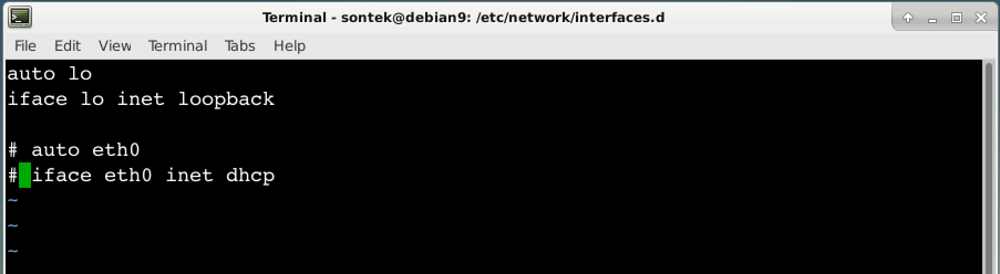

     编辑 `/etc/network/interfaces` 文件，注意不要配置网关（gateway），内容如下：

     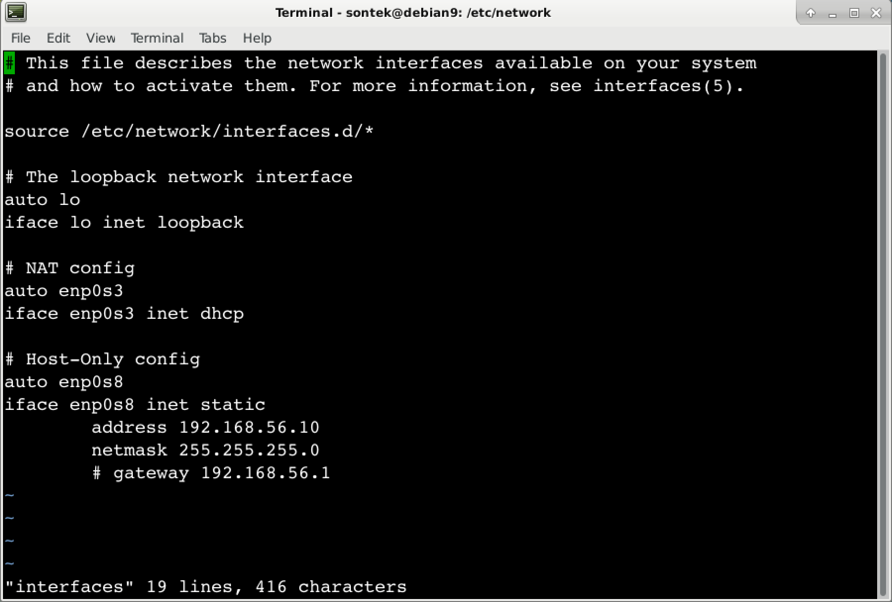

     此时已配置完毕，重启网络，并测试，如下：

     ```shell
     # systemctl restart networking      重启网络
     # systemctl status  networking      查看状态
     # ip addr							查看IP信息
     # ping www.baidu.com				测试是否可以访问外网
     ```

     在宿主主机测试是否能访问 `Debian` ，如下：

     ```shell
     ping 192.168.56.10         # host-only 配置的IP
     ```

   * 桥接

     在以桥接的方式配置网络之前，恢复刚刚 `NAT + Host-Only` 的配置，如果没有进行  `NAT + Host-Only`的配置则忽略。

     首先启动  `Virtual Box` 进行网络配置，配置单个网卡，并且连接方式为桥接，如图：

     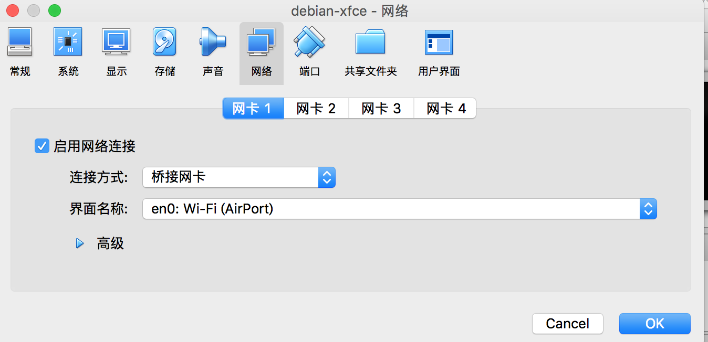

     启动 `Debian` ，首先将 `/etc/network/interface.d/setup` 文件中关于 `eth0` 的配置注释掉，否则在启动网络服务时，会出现如下错误：ifup：bring up eth0 fail，原内容如下：

     

     修改后如下：

     

     桥接可以配置静态IP的方式也可以配置 `DHCP` 的方式，修改 `/etc/network/interfaces` 文件，内容如下：

     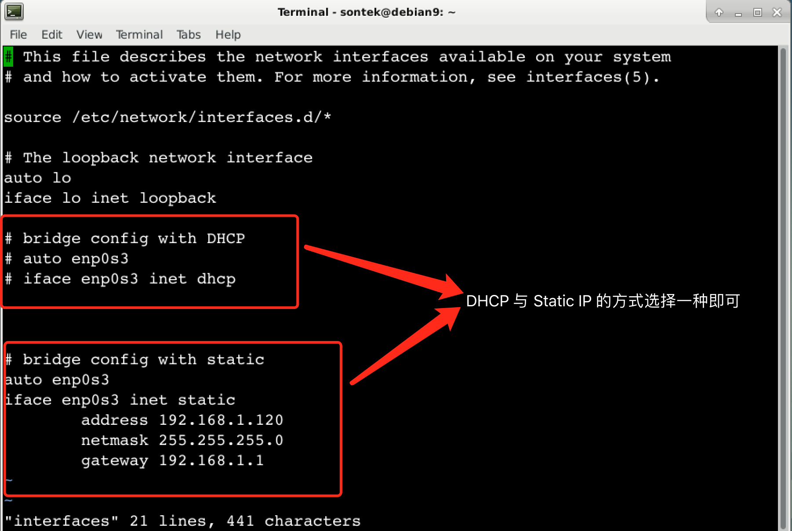

     `DHCP` 与静态IP 的方式，二者之选其一即可。重启网络，并查看其状态

       ```shell
     # systemctl restart networking			重启网络
     # systemctl status networking			查看状态
     # ip addr								查看IP地址
     # ping www.baidu.com					测试能否连接外网
       ```

     在宿主主机测试是否能访问 `Debian` ，如下：

     ```shell
     ping 192.168.1.120         # 这是我机器动态生成的IP，你的可能不同
     ```

   > 第二、使用 network-manager 的方式配置网络

     `network-manager` 可以使用图形界面的方式配置网络，它适用于笔记本电脑，因为它可以记住无线网络的密码，到达之后，可以直接连接上。`network-manager` 配置网络比较简单，下面我就简单介绍。

   还原一切刚才以 `networking` 方式配置网络的修改（很重要）。

   还是老样子，关闭 `networking` ， 启用 `network-manager `

   ```shell
   # systemctl stop networking      	  停用 networking
   # systemctl status networking.        查看 networking 状态
   # systemctl disable networking.       开机不启动 networking
   
   # systemctl enable network-manager    开机启动 network-manager
   # systemctl start network-manager     启动 network-manager
   # systemctl status network-manager    查看 network-manager 状态
   
   # reboot
   
   ```

   查看已配置的网络：

   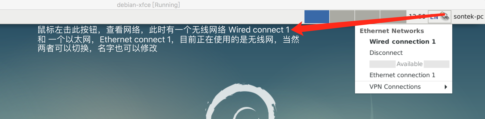

   网络配置

   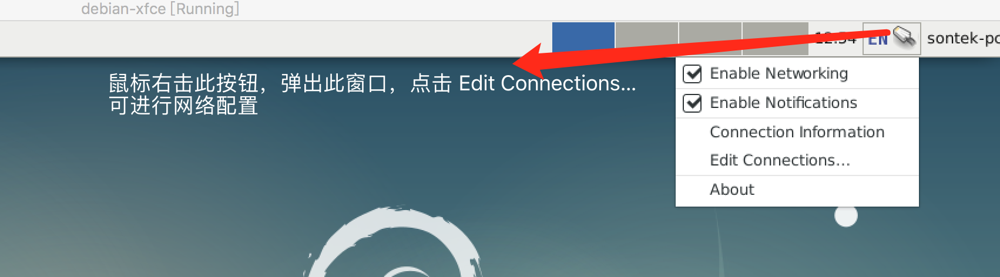

   添加网络配置

   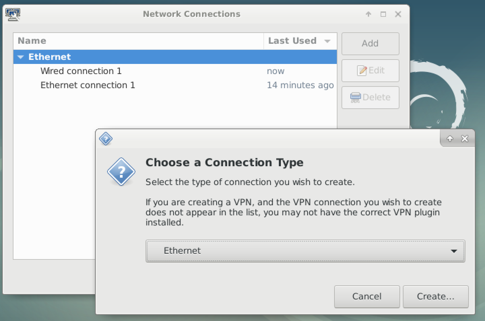

   选择网络类型，无线（Wi-Fi）或者以太网（Ethernet）:

   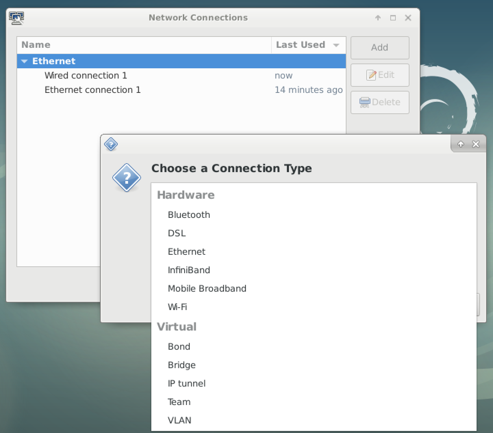

   图形界面的配置比较简单，以下步骤自己配置即可。

4. 安装open-ssh，并配置

   # apt install ssh
   # vim /etc/ssh/sshd_config
   // 见阮一峰配置

5. 更换阿里云镜像或者 163 的也可以 (root用户操作)
  # cp /etc/apt/sources.list /etc/apt/sources.list.bak
  输入如下内容
  deb http://mirrors.aliyun.com/debian stretch main contrib non-free
  deb-src http://mirrors.aliyun.com/debian stretch main contrib non-free
  deb http://mirrors.aliyun.com/debian stretch-updates main contrib non-free
  deb-src http://mirrors.aliyun.com/debian stretch-updates main contrib non-free
  deb http://mirrors.aliyun.com/debian-security stretch/updates main contrib non-free
  deb-src http://mirrors.aliyun.com/debian-security stretch/updates main contrib non-free
  执行如下命令
  apt update
  apt list --upgradable
  apt upgrade

6. 安装 zsh, on-my-zsh, Vim, git 并配置（普通用户）
  vim
  $ sudo apt install vim
  zsh
  $ sudo apt install zsh
  git
  $ sudo apt install git
  oh-my-zsh
  $ sudo apt install curl wget
  $ sh -c "$(curl -fsSL https://raw.github.com/robbyrussell/oh-my-zsh/master/tools/install.sh)"
  可以更换主题
  vim .zshrc 
  将如下内容替换即可
  ZSH_THEME="robbyrussell"  --> ZSH_THEME="ys"
  $ source ./.zshrc   使修改生效

7. 安装搜狗输入法(安装前看看有啥输入法)
   到搜狗输入法官方网站，下载 linux 版搜狗拼音输入法
   $ sudo dpkg -i sogoupinyin_version_amd64.deb
   // 安装错误图片
   $ sudo apt install libqt4-declarative zip fcitx-libs
   继续安装搜狗拼音输入法
   $ sudo reboot

8. 安装 i3 窗口管理器
   $ sudo apt install i3
   https://www.devpy.me/your-guide-to-a-practical-linux-desktop-with-i3wm/

9. 安装JDK
  Oracle 官网下载 JDK
  tar -zxvf jdk-8u151-linux-x64.tar.gz
  $ mkdir -p ~/opt/mysoftware
  配置环境变量
  $ vim .zshrc  添加如下内容
  ```
   export JAVA_HOME=~/opt/mysoftware/jdk1.8.0_151
  export CLASSPATH=.:$JAVA_HOME/lib/tools.jar:$JAVA_HOME/lib/dt.jar
  export PATH=$JAVA_HOME/bin:$PATH
  ```
  $ source .zshrc

10. 安装 maven
  $ tar -zxvf apache-maven-3.5.4-bin.tar.gz -C opt/mysoftware
  配置环境变量
   $ vim .zshrc  添加如下内容
  ```
   export MVN_HOME=~/opt/mysoftware/maven3.5.4
  export PATH=$MVN_HOME/bin:$PATH
  ```
   $ source .zshrc
   $ mvn -v
  编辑
  $MVN_HOME/conf/settings.xml
  修改如下
  <localRepository>~/opt/repo<localRepository>

11. 安装IDEA
   从官网下载 Linux 版本的IDEA
   $ tar -zxvf ideaIU-2018.1.6.tar.gz -C opt/mysoftware
   激活IDEA 请参考 http://idea.liyang.io/
   https://blog.csdn.net/qq_35246620/article/details/79050895

   

   

   

   

   

   

   

   

   

   

   

   

   

   

   


