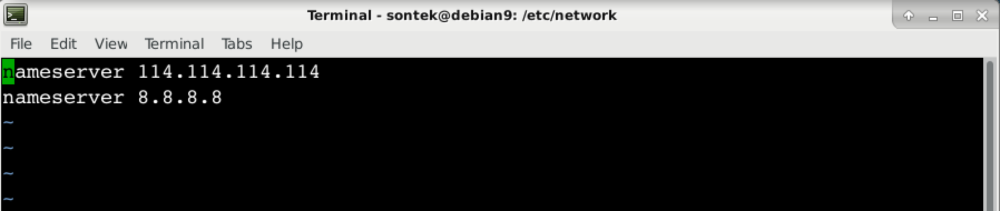

# Debian 安装之后的配置

安装完 `debian` 之后，需要进行一些配置，才能使得  `Debian` 使用起来更加方便，下面就一步一步配置 `Debian` 打造专属自己的开发环境。

### 1. 安装 Virtual Box Tools

为了使用`Virtual Box` 的增强功能，需要安装 Virtual-Box Tools，首先挂载 `Virtual Box Tools`，然后执行如下命令（root 用户操作）：

```shell
	# cp -R /media/cdrom0 /tmp
	# cd /tmp/cdrom0/
	# ./VBoxLinuxAdditions.run
	# reboot
```

### 2. 添加 sudo 权限

添加 `sudo` 权限，使得普通用户也有 `root` 权限（root用户操作）, `Debian` 默认安装了 `sudo` 否则，应该首先安装 `sudo`，使用此命令 `# apt install sudo`

```shell
	# vi /etc/sudoers
	找到 
	root 	ALL=(ALL:ALL) ALL
	添加如下内容
	sontek  ALL=(ALL:ALL) ALL
	wq! 保存退出 vi
```

### 3. Debian 网络配置

`Debian` 网络配置 （root用户操作），关于 `Debian` 的网络配置稍微复杂点，下面一一讲解。

首先，`Debian` 使用两种方式配置网络，第一种是  `/etc/init.d/networking`，以下以 `networking`简称，第二种是 `/etc/init.d/network-manager`，以下以 `network-manager` 简称，两者之间只取其一，即尽量不要让两者同时使用。

###### 1） 使用 networking 配置网络

首先禁用 `network-manager`，启用 `networking`，然后重启。

```shell
# systemctl stop network-manager      停用 network-manager
# systemctl status network-manager    查看 network-manager 状态
# systemctl disable network-manager   开机不启动 network-manager

# systemctl enable networking         开机启动 networking
# systemctl start networking          启动 networking
# systemctl status networking         查看 networking 状态

# reboot
```

`Virtual Box` 安装系统时，默认网络配置为 `NAT` 即 `网络地址转换NAT` ，这种方式配置的网络，本机不能访问安装的 `Debian` 虚拟机，但是 `Debian`  虚拟机可以访问外网。如果要实现虚拟机里面的 `Debian` 既能访问外网，又能实现与宿主主机的访问，有两种方式：`NAT + Host-Only` 方式，桥接方式。

* NAT + Host-Only 既实现连接 `Internet` ，又能与宿主主机通信。

  将系统关机 `# shutdown -h now`

  启动 `Virtual Box` 按下 `Ctrl + g` 全局配置网络。如图所示

   

  点击右侧的编辑按钮，配置静态IP 和 DHCP 如图所示：

  

  

  给 `Debian` 虚拟机分别配置 `NAT` 和 `Host-Only` 两个网卡

  

  

  启动 `Debain` ,打开终端，输入 `ip addr` 查看网络接口设备，如图：

  

  `enp0s3` 为 `NAT` 网卡设备，`enp0s8`  为 `Host-Only` 网卡设备，下面进行配置：

  首先将 `/etc/network/interfaces.d/setup` 文件中关于 `eth0` 的配置注释掉，否则在启动网络服务时，会出现如下错误：ifup：bring up eth0 fail，原内容如下：

  

  修改后如下：

  

  编辑 `/etc/network/interfaces` 文件，注意不要配置网关（gateway），内容如下：

  

  此时已配置完毕，重启网络，并测试，如下：

  ```shell
  # systemctl restart networking      重启网络
  # systemctl status  networking      查看状态
  # ip addr							查看IP信息
  # ping www.baidu.com				测试是否可以访问外网
  ```

  在宿主主机测试是否能访问 `Debian` ，如下：

  ```shell
  ping 192.168.56.10         # host-only 配置的IP
  ```

* 桥接

  在以桥接的方式配置网络之前，恢复刚刚 `NAT + Host-Only` 的配置，如果没有进行  `NAT + Host-Only`的配置则忽略。

  首先启动  `Virtual Box` 进行网络配置，配置单个网卡，并且连接方式为桥接，如图：

  

  启动 `Debian` ，首先将 `/etc/network/interface.d/setup` 文件中关于 `eth0` 的配置注释掉，否则在启动网络服务时，会出现如下错误：ifup：bring up eth0 fail，原内容如下：

  

  修改后如下：

  

  桥接可以配置静态IP的方式也可以配置 `DHCP` 的方式，修改 `/etc/network/interfaces` 文件，内容如下：

  

  `DHCP` 与静态IP 的方式，二者之选其一即可。

  配置`DNS`，否则会出现 `ping:  unknown host` 错误，配置如下：

  

  重启网络，并查看其状态

    ```shell
  # systemctl restart networking			重启网络
  # systemctl status networking			查看状态
  # ip addr								查看IP地址
  # ping www.baidu.com					测试能否连接外网
    ```

  在宿主主机测试是否能访问 `Debian` ，如下：

  ```shell
  ping 192.168.1.120         # 这是我机器动态生成的IP，你的可能不同
  ```

###### 2） 使用 network-manager 的方式配置网络

  `network-manager` 可以使用图形界面的方式配置网络，它适用于笔记本电脑，因为它可以记住无线网络的密码，到达之后，可以直接连接上。`network-manager` 配置网络比较简单，下面我就简单介绍。

还原一切刚才以 `networking` 方式配置网络的修改（很重要）。

还是老样子，关闭 `networking` ， 启用 `network-manager `

```shell
# systemctl stop networking      	  停用 networking
# systemctl status networking.        查看 networking 状态
# systemctl disable networking.       开机不启动 networking

# systemctl enable network-manager    开机启动 network-manager
# systemctl start network-manager     启动 network-manager
# systemctl status network-manager    查看 network-manager 状态

# reboot

```

查看已配置的网络：


网络配置


添加网络配置


选择网络类型，无线（Wi-Fi）或者以太网（Ethernet）:


图形界面的配置比较简单，以下步骤自己配置即可。

### 3. 安装openssh-server，并配置

安装 `opens-server`:

```shell
# apt install openssh-server
```

默认安装的 `ssh`  配置文件不完整，需要对其进行简单的配置，编辑主配置文件，如下：

```shell
# vi /etc/ssh/sshd_config
```

将如下内容的注释去掉，即将其前面的  `#` 去掉

```shell
Port 22 								# 也可以修改为其他端口
PermitRootLogin no						# 禁止 root 登录
PermitEmptyPasswords no					# 禁止无密码登录
PasswordAuthentication yes				# 允许使用密码登录

PubkeyAuthentication yes				# 允许使用认证登录
AuthorizedKeysFile .ssh/authorized_keys # 认证文件位置

# 文件末尾添加如下内容
AllowUsers sontek	

```

重启 `sshd` 服务

```shell
# systemctl restart ssh       # 重启服务

# 补充命令如下
# systemctl start ssh
# systemctl stop ssh
# systemctl status ssh
```

### 4. 更换镜像源

为了提高访问速度，可将 `Debian` 的镜像地址换成阿里云镜像或者是 `163` ，更换阿里云镜像如下：

备份原镜像文件

 ```shell
# cp /etc/apt/sources.list /etc/apt/sources.list.bak
 ```

修改  `/etc/apt/sources.list` 改为如下内容：

```shell
deb http://mirrors.aliyun.com/debian stretch main contrib non-free
deb-src http://mirrors.aliyun.com/debian stretch main contrib non-free

deb http://mirrors.aliyun.com/debian stretch-updates main contrib non-free
deb-src http://mirrors.aliyun.com/debian stretch-updates main contrib non-free

deb http://mirrors.aliyun.com/debian-security stretch/updates main contrib non-free
deb-src http://mirrors.aliyun.com/debian-security stretch/updates main contrib non-free
```

更新镜像，执行如下命令

```shell
# apt update				# 更新镜像
# apt list --upgradable		# 列出可升级软件包
# apt upgrade				# 升级软件包
```

### 5. 安装基本的软件包

* 安装 vim，zsh，git，wget，curl，net-tools

  ```shell
  $ sudo apt install vim zsh git wget curl net-tools
  ```

* 安装 oh-my-zsh

  ```shell
  $ sh -c "$(curl -fsSL https://raw.github.com/robbyrussell/oh-my-zsh/master/tools/install.sh)"
  # 更换主题
  $ vim .zshrc
  # 将 ZSH_THEME="robbyrussell"  --> ZSH_THEME="ys"
  $ source .zshrc   # 使其生效
  ```

### 6. 安装搜狗拼音输入法

到搜狗输入法官方网站，下载 linux 版搜狗拼音输入法，然后对其进行安装：

 ```shell
$ sudo dpkg -i sogoupinyin_2.2.0.0108_amd64.deb
 ```

出现如下错误：


根据提示显示是缺少软件包，安装缺少软件包

```shell
$ sudo apt install libqt4-declarative zip fcitx-libs
```

继续执行安装搜狗拼音输入法。然后重启。

### 7. 安装窗口管理器（i3）

安装 i3 窗口管理器
```
$ sudo apt install i3
```
可使用如下命令生成默认的配置文件
```
$ i3-config-wizard
```
配置
```
bindsym $mod+shift+x exec i3lock 锁屏
$mod + shift + r 使配置文件生效
exec firefox  表示启动 i3 时候，启动 firefox
feh 桌面相关
sudo apt install feh
feh --bg-scale /path/to/destop.jpg
exec_always feh --bg-scale /path/to/destop.jpg

# 查询是什么
sudo apt install arandr


定义变量
set $workspace "1: Terminal"


# 指定某个软件在指定的workspace

# 安装 FortAwesome / Fort Awesome 添加 icon
cp fonts ~/.fonts
fortawesome.github.io/cheatsheet

# 配置字体和字号
San Franceisco Fonts

# 配置 gtk
sudo apt install lxapperance

# 取色
http://www.color.picker.com
```
https://www.devpy.me/your-guide-to-a-practical-linux-desktop-with-i3wm/

### 8. 安装 Java 开发环境

* 安装 JDK

  从Oracle 官网下载 JDK，下载JDK1.8

  ```shell
  $ tar -zxvf jdk-8u151-linux-x64.tar.gz
  $ mkdir -p ~/opt/mysoftware
  ```

  配置环境变量，编辑 `~/.zshrc`  文件，添加如下配置

  ```shell
  export JAVA_HOME=~/opt/mysoftware/jdk1.8.0_151
  export CLASSPATH=.:$JAVA_HOME/lib/tools.jar:$JAVA_HOME/lib/dt.jar
  export PATH=$JAVA_HOME/bin:$PATH
  ```

  启用配置，查看安装版本

  ```shell
  $ source .zshrc
  $ java -version
  java version "1.8.0_181"
  Java(TM) SE Runtime Environment (build 1.8.0_181-b13)
  Java HotSpot(TM) 64-Bit Server VM (build 25.181-b13, mixed mode)
  ```

* 安装 maven

  首先从 `Apache Maven` 官网，下载  `maven` 软件包，然后对其解压配置即可。

   ```shell
  $ tar -zxvf apache-maven-3.5.4-bin.tar.gz -C opt/mysoftware/maven-3.5.4
   ```

  配置环境变量，编辑 `~/.zshrc`  文件，添加如下配置

  ```shell
  export MVN_HOME=~/opt/mysoftware/maven-3.5.4
  export PATH=$MVN_HOME/bin:$PATH
  ```

  启用配置，查看安装版本

  ```shell
   $ source .zshrc
   $ mvn -v
   Apache Maven 3.5.4 (1edded0938998edf8bf061f1ceb3cfdeccf443fe; 2018-06-18T02:33:14+08:00)
  Maven home: /home/sontek/opt/mysoftware/maven-3.5.4
  Java version: 1.8.0_181, vendor: Oracle Corporation, runtime: /home/sontek/opt/mysoftware/jdk-1.8/jre
  Default locale: en_US, platform encoding: UTF-8
  OS name: "linux", version: "4.9.0-7-amd64", arch: "amd64", family: "unix"
  ```

  配置 `Maven` 本地仓库，先创建如下目录 `~/opt/repo`，然后编辑 `$MVN_HOME/conf/settings.xml` 文件，修改内容如下：

   ```shell
  <localRepository>~/opt/repo<localRepository>
   ```

* 安装IDEA

  从官网下载 `Linux` 版本的 `IDEA`，并解压：

   ```shell
  $ tar -zxvf ideaIU-2018.1.6.tar.gz -C opt/mysoftware/
  $ cd ~/opt/mysoftware/idea-IU/bin
  $ ./idea.sh							# 启动 IDEA
   ```

  激活 `IDEA`，访问如下网站进行激活。连接如下：

  [激活IDEA](http://idea.lanyus.com/)

### 9. 安装常用软件

* 安装 NodeJS  
    上 `Nodejs` 官网，下载对应平台的软件包，解压到指定目录，并配置环境变量，我的配置如下：
    ```
    $ vim ~/.zshrc
    # 添加如下配置
    export NODE_HOME=~/opt/mysoftware/node-8
    export PATH=$NODE_HOME/bin:$PATH

    # 使配置生效
    $ source .zshrc
    ```

* 安装 Chromium 浏览器
    ```
    $ sudo apt update
    $ sudo apt install chromium 
    ```

* 安装 Filezilla
    ```
    $ sudo apt update
    $ sudo apt install filezilla
    ```

* 安装视频播放器 VLC
    ```
    $ sudo apt install vlc
    # 使用 VLC
    $ vlc xxx.mp4
    ```
* 安装网易云音乐客户端
    首先上网易云音乐官网下载对应的客户端
    ```
    $ sudo dpkg -i  netease-cloud-music_1.1.0_ubuntu_amd64.deb
    ```

* 安装邮件客户端
    ```
    $ sudo apt install thunderbird
    ```

* 安装 SVN
    ```
    $ sudo apt install subversion
    ```

* 安装 screenfetch 打印操作系统的 `logo` 和使用状态  
    ```
    $ sudo apt install screenfetch
    ```
* 科学上网 Shadowsocks  
    首先访问 [Github](https://github.com/shadowsocks) 找到 `shadowsocks-qt5` 项目  
    根据其 wiki 提示进行安装即可  
    如果是 `Chromium` 浏览器还需要安装插件，下载插件地址请点击[这里](https://github.com/FelisCatus/SwitchyOmega)  
    找到其对应的发行版，然后安装 `Chromium` 插件，对其进行配置即可。
    注意：
    如果安装不上插件，则将 `crx` 后缀的插件改成 `zip` 然后对其进行解压，然后将开发者模式打开，加载解压的文件夹即可

* 安装微信  
    访问 [Github](https://github.com/geeeeeeeeek/electronic-wechat) 按照上面的说明一步一步操作即可
    下载对应的发布版本，并解压到制定的目录，然后启动微信客户端
    ```
    $ cd elecontronic-wechat
    $ ./elecontronic-wechat
    ```
* 安装字体  
    首先是下载想要安装的字体,可参考如下网站.  
    [Github](https://github.com), [fontsquirrel](https://www.fontsquirrel.com)  
    然后在 `/usr/share/fonts/` 创建相应的字体目录  
    ```
    sudo mkdir /usr/share/fonts/opentype/SourceCodePro
    或者将字体安装到家目录下
    mkdir ~/.fonts
    将字体拷贝到创建的目录下面
    ```
    将下载的字体解压到刚刚创建的目录中,然后执行如下命令:
    ```
    sudo fc-cache -f -v    使字体生效
    ```

* 安装 QQ

