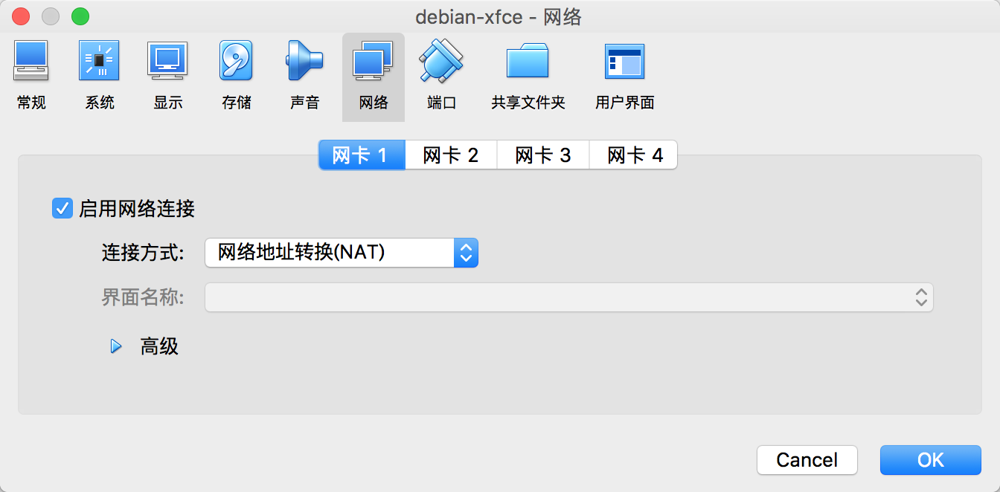

# Debian 安装之后的配置

安装完 `debian` 之后，需要进行一些配置，才能使得  `Debian` 使用起来更加方便，下面就一步一步配置 `Debian` 打造专属自己的开发环境。

1. 为了使用`Virtual Box` 的增强功能，需要安装 Virtual-Box Tools，首先挂载 `Virtual Box Tools`，然后执行如下命令（root 用户操作）：
```shell
	# cp -R /media/cdrom0 /tmp
	# cd /tmp/cdrom0/
	# ./VBoxLinuxAdditions.run
	# reboot
```

2. 添加 `sudo` 权限，使得普通用户也有 `root` 权限（root用户操作）, `Debian` 默认安装了 `sudo` 否则，应该首先安装 `sudo`，使用此命令 `# apt install sudo`
```shell
	# vi /etc/sudoers
	找到 
	root 	ALL=(ALL:ALL) ALL
	添加如下内容
	sontek  ALL=(ALL:ALL) ALL
	wq! 保存退出 vi
```

3. `Debian` 网络配置 （root用户操作），关于 `Debian` 的网络配置稍微复杂点，下面一一讲解。

   首先，`Debian` 使用两种方式配置网络，第一种是  `/etc/init.d/networking`，以下以 `networking`简称，第二种是 `/etc/init.d/network-manager`，以下以 `network-manager` 简称，两者之间只取其一，即尽量不要让两者同时使用。

   > 使用 networking 配置网络

   首先禁用 `network-manager`，启用 `networking`，然后重启。

   ```shell
   # systemctl stop network-manager      停用 network-manager
   # systemctl status network-manager    查看 network-manager 状态
   # systemctl disable network-manager   开机不启动 network-manager
   
   # systemctl enable networking         开机启动 networking
   # systemctl start networking          启动 networking
   # systemctl status networking         查看 networking 状态
   
   # reboot
   ```

   `Virtual Box` 安装系统时，默认网络配置为 `NAT` 即 `网络地址转换NAT` ，这种方式配置的网络，本机不能访问安装的 `Debian` 虚拟机，但是 `Debian`  虚拟机可以访问外网。如果要实现虚拟机里面的 `Debian` 既能访问外网，又能实现与宿主主机的访问，有两种方式：`NAT + Host-Only` 方式，桥接方式。

   * NAT + Host-Only 既实现连接 `Internet` ，又能与宿主主机通信。

     将系统关机 `# shutdown -h now`

     启动 `Virtual Box` 按下 `Ctrl + g` 全局配置网络。如图所示

      

     点击右侧的编辑按钮，配置静态IP 和 DHCP 如图所示：

     

     

     给 `Debian` 虚拟机分别配置 `NAT` 和 `Host-Only` 两个网卡

     

     

     启动 `Debain` 

     

   * 桥接

```

	# vim /etc/network/interfaces
	# 查看 设备名称 
	# ip addr 
	systemctl disable network-manager
	systemctl enable networking
```

4. 安装open-ssh，并配置
   # apt install ssh
   # vim /etc/ssh/sshd_config
   // 见阮一峰配置

3. 更换阿里云镜像或者 163 的也可以 (root用户操作)
	# cp /etc/apt/sources.list /etc/apt/sources.list.bak
	输入如下内容
	deb http://mirrors.aliyun.com/debian stretch main contrib non-free
	deb-src http://mirrors.aliyun.com/debian stretch main contrib non-free
	deb http://mirrors.aliyun.com/debian stretch-updates main contrib non-free
	deb-src http://mirrors.aliyun.com/debian stretch-updates main contrib non-free
	deb http://mirrors.aliyun.com/debian-security stretch/updates main contrib non-free
	deb-src http://mirrors.aliyun.com/debian-security stretch/updates main contrib non-free
	执行如下命令
	apt update
	apt list --upgradable
	apt upgrade

4. 安装 zsh, on-my-zsh, Vim, git 并配置（普通用户）
	vim
	$ sudo apt install vim
	zsh
	$ sudo apt install zsh
	git
	$ sudo apt install git
	oh-my-zsh
	$ sudo apt install curl wget
	$ sh -c "$(curl -fsSL https://raw.github.com/robbyrussell/oh-my-zsh/master/tools/install.sh)"
	可以更换主题
	vim .zshrc 
	将如下内容替换即可
	ZSH_THEME="robbyrussell"  --> ZSH_THEME="ys"
	$ source ./.zshrc   使修改生效
5. 安装搜狗输入法(安装前看看有啥输入法)
   到搜狗输入法官方网站，下载 linux 版搜狗拼音输入法
   $ sudo dpkg -i sogoupinyin_version_amd64.deb
   // 安装错误图片
   $ sudo apt install libqt4-declarative zip fcitx-libs
   继续安装搜狗拼音输入法
   $ sudo reboot
6. 安装 i3 窗口管理器
   $ sudo apt install i3
   https://www.devpy.me/your-guide-to-a-practical-linux-desktop-with-i3wm/
7. 安装JDK
	Oracle 官网下载 JDK
   tar -zxvf jdk-8u151-linux-x64.tar.gz
   $ mkdir -p ~/opt/mysoftware
   配置环境变量
   $ vim .zshrc  添加如下内容
   ```
    export JAVA_HOME=~/opt/mysoftware/jdk1.8.0_151
	export CLASSPATH=.:$JAVA_HOME/lib/tools.jar:$JAVA_HOME/lib/dt.jar
	export PATH=$JAVA_HOME/bin:$PATH
   ```
   $ source .zshrc
8. 安装 maven
	$ tar -zxvf apache-maven-3.5.4-bin.tar.gz -C opt/mysoftware
	配置环境变量
    $ vim .zshrc  添加如下内容
   ```
    export MVN_HOME=~/opt/mysoftware/maven3.5.4
	export PATH=$MVN_HOME/bin:$PATH
   ```
    $ source .zshrc
    $ mvn -v
	编辑
	$MVN_HOME/conf/settings.xml
	修改如下
	<localRepository>~/opt/repo<localRepository>
8. 安装IDEA
	从官网下载 Linux 版本的IDEA
   $ tar -zxvf ideaIU-2018.1.6.tar.gz -C opt/mysoftware
   激活IDEA 请参考 http://idea.liyang.io/
   https://blog.csdn.net/qq_35246620/article/details/79050895

   
   
   
   
   
   
   
   
   
   
   
   
   
   
   
   
   
   
   
   
   
   
   
   
   
   
   
   
   


