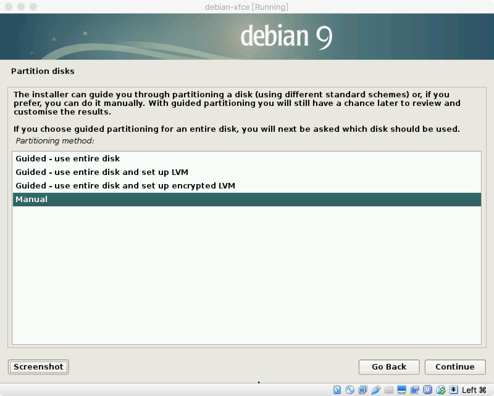
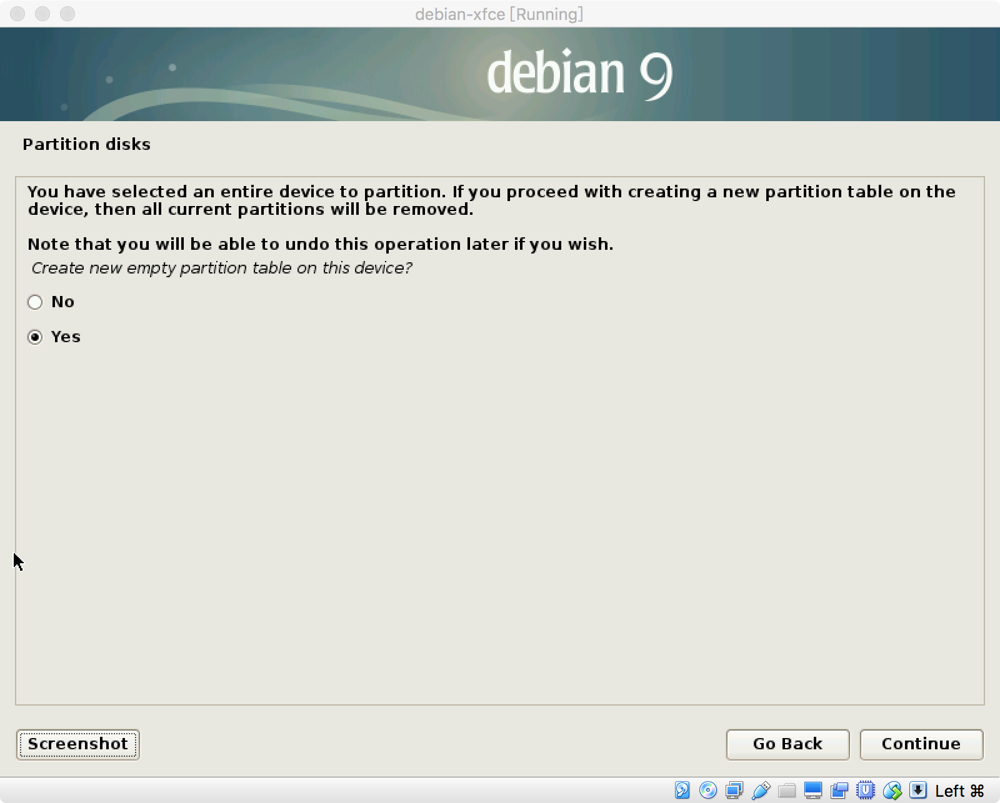
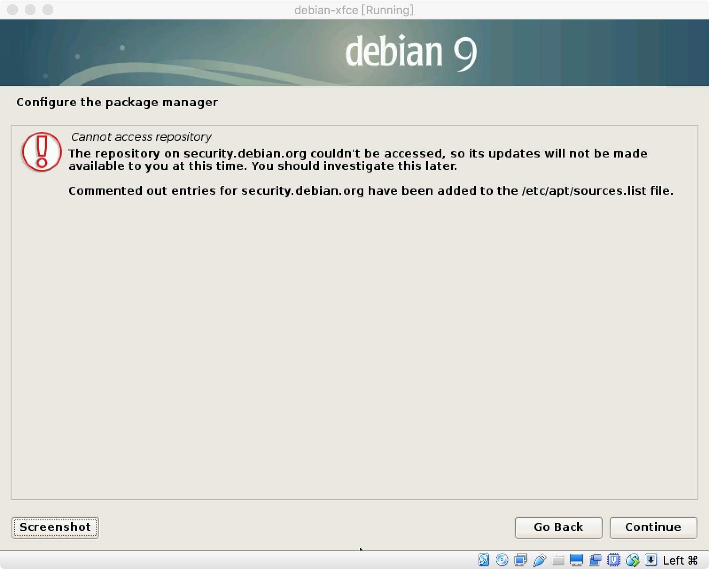
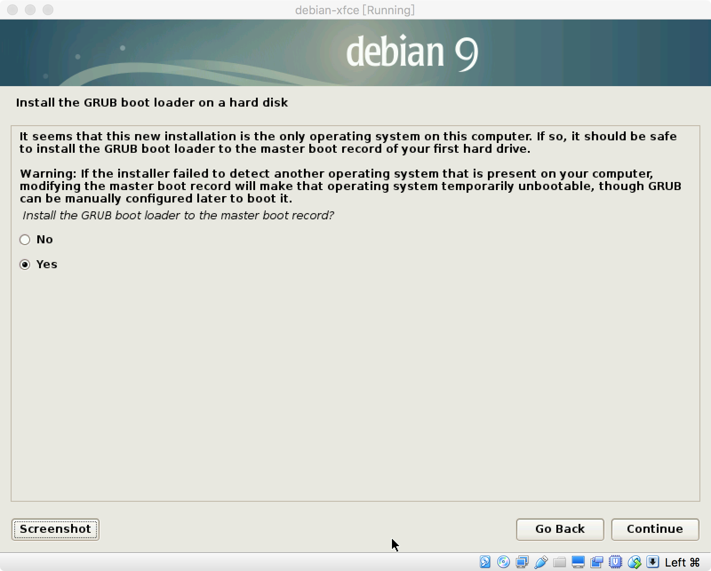

# Debian 安装

首先从 Debian 官网下载 Debian 操作系统。本文安装的操作系统是 debian-9.5.0，本文是基于 VirtualBox VM 进行安装的，具体安装步骤如下：

1. 启动虚拟机时的首个界面，选择使用图形界面安装的方式  
  

2. 选择语言，最好选择 English，也可以选择简体中文
  

3. 选择所在的地区，按实际情况选择即可，此处选择 China
  
  
  

4. 配置 Locale 
  

5. 配置键盘键映射
  

6. 配置键盘键映射
  
  

7. 配置主机名称
  

8. 设置 root 的密码
  

9. 新建用户以及设置密码
  
  
  

10. 磁盘分区
  
  
  
  

11. 创建 /boot 分区，一般设置 1G 大小
  
  
  
  
  
  
  
  
  

12. 创建根分区，大小设置 25G 左右，可根据实际情况设置
  
  
  
  
  
  

13. 创建 swap 分区 一般设置实际内存的 2 倍，但是最大不要超过 8G 
  
  
  
  
  
  
  
  
  

14. 创建 /home 分区，剩下的空间可全部分给 /home 分区
  
  
  
  
  
  

15. 安装系统  
  

16. 配置包管理，是否启用网络镜像  
  
  
  
  
  

17. 安装 GRUB 到磁盘
  
  

18. 安装完成并重启
  

19. 大功告成，看到登录界面
  
