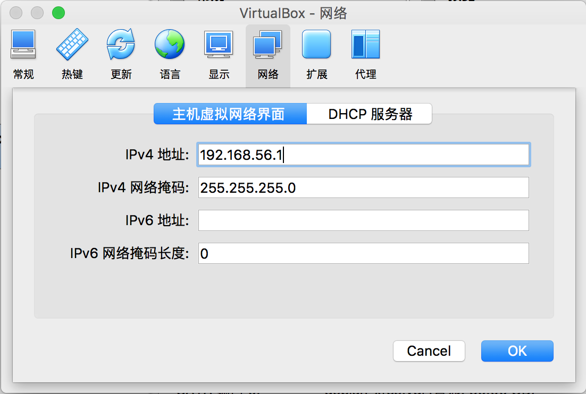
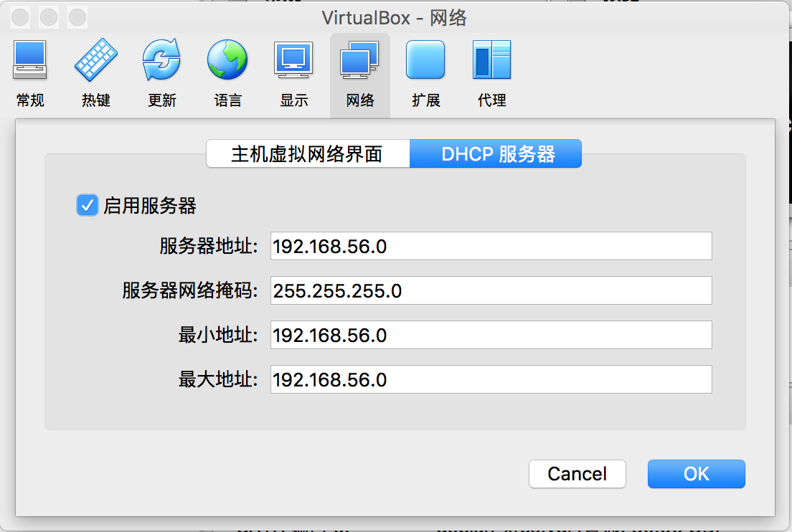
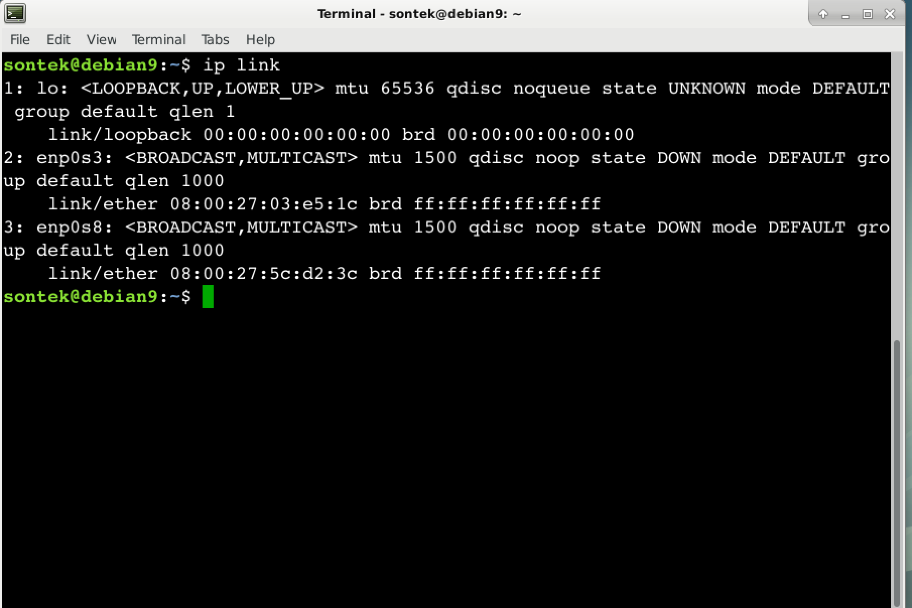
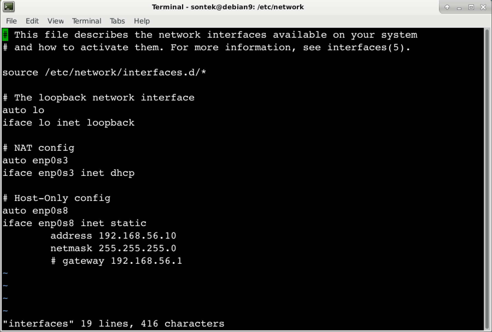

# Debian 网络配置

`Debian` 网络配置 （root用户操作），关于 `Debian` 的网络配置稍微复杂点，下面一一讲解。

首先，`Debian` 使用两种方式配置网络，第一种是  `/etc/init.d/networking`，以下以 `networking`简称，第二种是 `/etc/init.d/network-manager`，以下以 `network-manager` 简称，两者之间只取其一，即尽量不要让两者同时使用。

## 1. 使用 networking 配置网络

首先禁用 `network-manager`，启用 `networking`，然后重启。

```shell
# systemctl stop network-manager      停用 network-manager
# systemctl status network-manager    查看 network-manager 状态
# systemctl disable network-manager   开机不启动 network-manager

# systemctl enable networking         开机启动 networking
# systemctl start networking          启动 networking
# systemctl status networking         查看 networking 状态

# reboot
```

`Virtual Box` 安装系统时，默认网络配置为 `NAT` 即 `网络地址转换NAT` ，这种方式配置的网络，本机不能访问安装的 `Debian` 虚拟机，但是 `Debian`  虚拟机可以访问外网。如果要实现虚拟机里面的 `Debian` 既能访问外网，又能实现与宿主主机的访问，有两种方式：`NAT + Host-Only` 方式和桥接方式。

* NAT + Host-Only 既实现连接 `Internet` ，又能与宿主主机通信。

  将系统关机 `# shutdown -h now`

  启动 `Virtual Box` 按下 `Ctrl + g` 全局配置网络。如图所示

   

  点击右侧的编辑按钮，配置静态IP 和 DHCP 如图所示：

  

  

  给 `Debian` 虚拟机分别配置 `NAT` 和 `Host-Only` 两个网卡

  

  

  启动 `Debain` ,打开终端，输入 `ip addr` 查看网络接口设备，如图：

  

  `enp0s3` 为 `NAT` 网卡设备，`enp0s8`  为 `Host-Only` 网卡设备，下面进行配置：

  首先将 `/etc/network/interfaces.d/setup` 文件中关于 `eth0` 的配置注释掉，否则在启动网络服务时，会出现如下错误：ifup：bring up eth0 fail，原内容如下：

  

  修改后如下：

  

  编辑 `/etc/network/interfaces` 文件，注意不要配置网关（gateway），内容如下：

  

  此时已配置完毕，重启网络，并测试，如下：

  ```shell
  # systemctl restart networking      重启网络
  # systemctl status  networking      查看状态
  # ip addr							查看IP信息
  # ping www.baidu.com				测试是否可以访问外网
  ```

  在宿主主机测试是否能访问 `Debian` ，如下：

  ```shell
  ping 192.168.56.10         # host-only 配置的IP
  ```

* 桥接

  在以桥接的方式配置网络之前，恢复刚刚 `NAT + Host-Only` 的配置，如果没有进行  `NAT + Host-Only`的配置则忽略。

  首先启动  `Virtual Box` 进行网络配置，配置单个网卡，并且连接方式为桥接，如图：

  

  启动 `Debian` ，首先将 `/etc/network/interface.d/setup` 文件中关于 `eth0` 的配置注释掉，否则在启动网络服务时，会出现如下错误：ifup：bring up eth0 fail，原内容如下：

  

  修改后如下：

  

  桥接可以配置静态IP的方式也可以配置 `DHCP` 的方式，修改 `/etc/network/interfaces` 文件，内容如下：

  

  `DHCP` 与静态IP 的方式，二者之选其一即可。

  配置`DNS`，否则会出现 `ping:  unknown host` 错误，配置如下：

  

  重启网络，并查看其状态

    ```shell
  # systemctl restart networking			重启网络
  # systemctl status networking			查看状态
  # ip addr								查看IP地址
  # ping www.baidu.com					测试能否连接外网
    ```

  在宿主主机测试是否能访问 `Debian` ，如下：

  ```shell
  ping 192.168.1.120         # 这是我机器动态生成的IP，你的可能不同
  ```

## 2. 使用 network-manager 的方式配置网络

  `network-manager` 可以使用图形界面的方式配置网络，它适用于笔记本电脑，因为它可以记住无线网络的密码，到达之后，可以直接连接上。`network-manager` 配置网络比较简单，下面我就简单介绍。

还原一切刚才以 `networking` 方式配置网络的修改（很重要）。

还是老样子，关闭 `networking` ， 启用 `network-manager `

```shell
# systemctl stop networking      	  停用 networking
# systemctl status networking.        查看 networking 状态
# systemctl disable networking.       开机不启动 networking

# systemctl enable network-manager    开机启动 network-manager
# systemctl start network-manager     启动 network-manager
# systemctl status network-manager    查看 network-manager 状态

# reboot
```

查看已配置的网络：


网络配置


添加网络配置


选择网络类型，无线（Wi-Fi）或者以太网（Ethernet）:


图形界面的配置比较简单，以下步骤自己配置即可。
