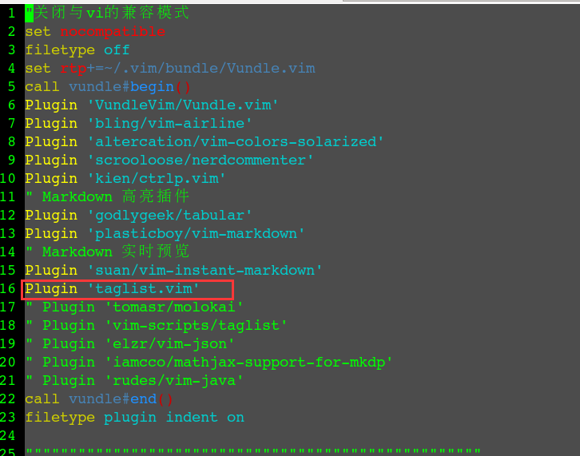

# taglist

#### 介绍
用过 eclipse 的人都知道这样一个功能，eclipse 能够把当前文件中的属性、方法显示在某小窗口，用鼠标点击即可跳转到指定的位置，可以按照字母排序等。**taglist** 插件所实现的就是上述类似的功能。

#### 安装
点击[这里](http://www.vim.org/scripts/script.php?script_id=273)，可以参考官方文档，进行安装。
本文是使用 `vundle` 插件来安装。如图: 
   
在 Vim 末行模式下执行 `:PluginInstall` 完成安装。

#### 配置
编辑 `~/.vimrc` 添加如下内容：
```
" 关联ctags程序
let Tlist_Ctags_Cmd="/usr/local/bin/ctags"
" 设置taglist的高度和宽度
let Tlist_WinHeight=30
let Tlist_WinWidth=30
" taglist 已tag名字排序，默认按出现顺序排序
let Tlist_Sort_Type=name
" 只显示当前文件的tag
let Tlist_Show_One_File=1
" 如果taglist是最后一个窗口，则退出Vim
let Tlist_Exit_OnlyWindow=1
" 在右侧窗口显示taglist
let Tlist_Use_Right_Window=1
" 启动Vim时就启动taglist
" let Tlist_Auto_Open=1
" 选择了tag之后，自动关闭taglist
let Tlist_Close_On_Select=1
" 同时显示多个文件tag时，设置Tlist_File_Fold_Auto_Close=1
" 则只显示当前文件tag，其他文件的tag都被折叠起来
let Tlist_File_Fold_Auto_Close=1
" 始终解析文件中的tag，无论taglist是否打开
let Tlist_Precess_File_Always=1
" TlistToggle 打开taglist时，焦点在taglist
let Tlist_GainFocus_On_ToggleOpen=1
" 映射 F8 打开或者关闭 taglist
nmap <F8> :TlistToggle<CR>
```

#### 命令使用
在 **taglist** 窗口中，可以使用如下快捷键：
```
<CR>    跳转到光标下tag所定义的位置
o       字母o，新打开窗口显示光标下的tag 
u       更新taglist窗口中的tag
s       更改排序方式，按名字排序和出现顺序排序间切换
x       taglist 窗口放大和缩小
+       打开折叠，同 zo
-       将tag折叠起来，同zc
*       打开所有tag折叠
=       将所有tag折叠起来
[[      跳转到前一个文件
]]      跳转到后一个文件
q       关闭taglist窗口
```

http://easwy.com/blog/archives/advanced-vim-skills-taglist-plugin/


